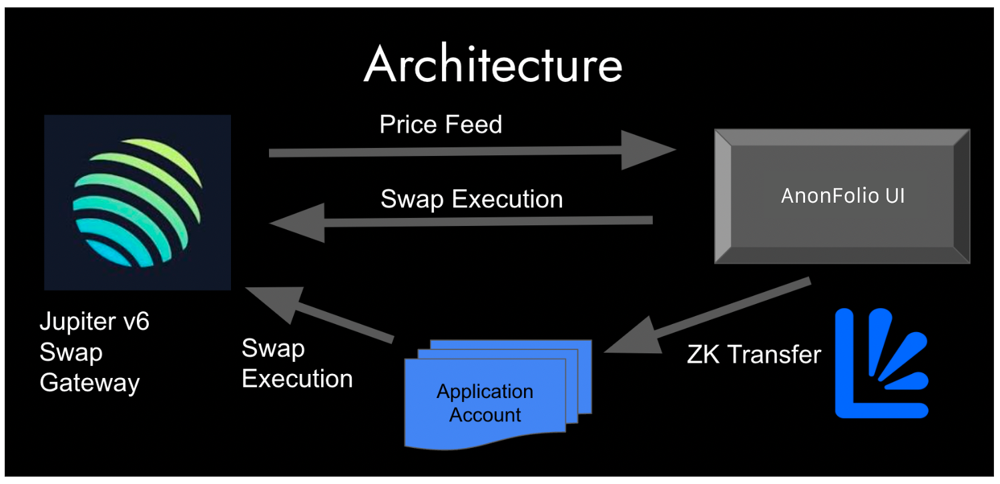

# AnonFolio
Bringing privacy to defi portfolio management.

## Description
AnonFolio is an advanced private swap management tool designed for traders and investors seeking to execute transactions with enhanced speed and confidentiality. By integrating both on-chain and off-chain technologies, AnonFolio offers a seamless and secure trading experience.

## Key Features:
- High-Speed Transactions with Solana: Leveraging Solana's high-performance blockchain, AnonFolio ensures rapid transaction processing, enabling traders to capitalize on market opportunities without delay.

- Comprehensive Token Access via Jupiter Aggregation: Through integration with Jupiter, AnonFolio provides users with access to a vast array of token listings, facilitating diverse investment strategies within a unified platform.

- Enhanced Privacy with Light Protocol: By incorporating the Light Protocol, AnonFolio allows users to conceal their identities during specific trades. This feature is crucial for preventing market manipulation tactics such as front-running, MEV bots, and copy trading, thereby safeguarding users' investment strategies.

- Intuitive Order Book Interface: AnonFolio's user-friendly interface aggregates multiple swaps into a cohesive order book view. This design enables users to manage and submit groups of transactions under a single signature efficiently, streamlining the trading process.

## Technical Overview:
AnonFolio's architecture is built upon the Solana blockchain, renowned for its scalability and low-latency transaction capabilities. The platform integrates with Jupiter to aggregate liquidity across various decentralized exchanges, ensuring optimal token swap rates for users. The implementation of the Light Protocol provides cryptographic methods to obscure transaction details, maintaining user anonymity and protecting trading strategies from adversarial actions.

By combining these technologies, AnonFolio delivers a robust solution for traders and investors seeking a secure, efficient, and private platform to manage their crypto assets.

## Architecture

